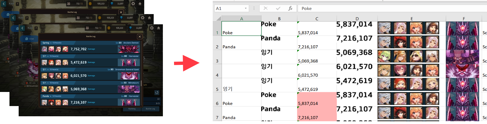
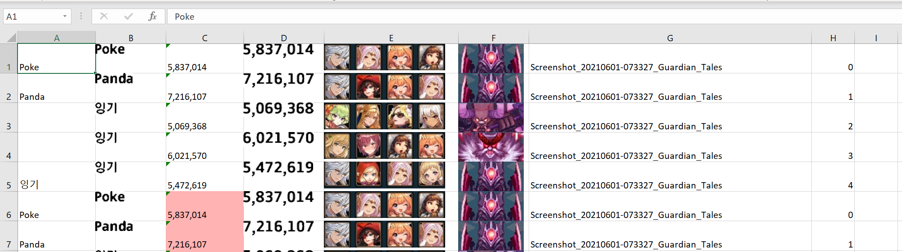
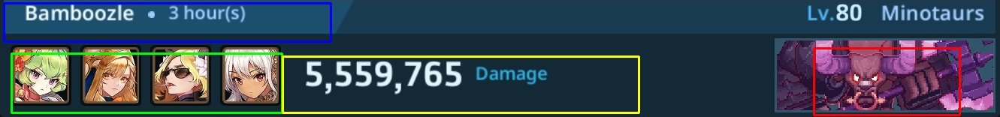
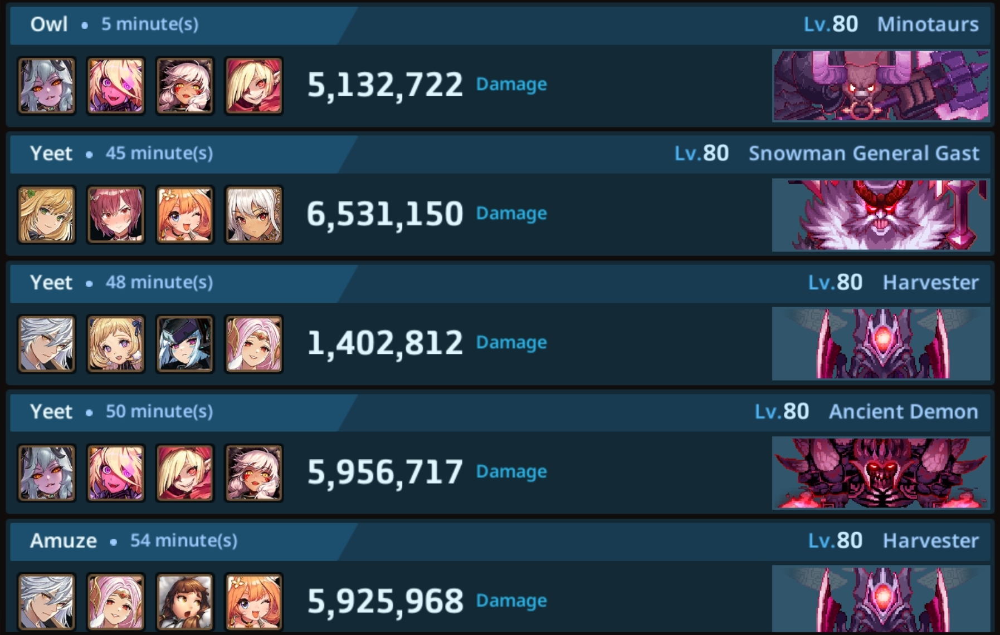
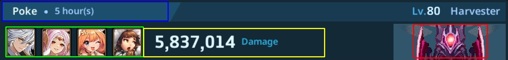

Utility to automatically parse Guardian Tales screenshots and build Excel spreadsheets
with raid hits, utilizing computer vision (OpenCV) and text recognision (pyTesseract). 




Currently the workflow assumed to be:

- An admin has python and everything installed 
- He saves the raid screenshots to a folder 
- Then he runs this script, which recognizes all images 
  and creates Excel file with results
- The Excel file contains both images and recognized names/damages

Readiness: 

- [x] name + damage image recognition
- [x] support multiple resolutions
- [x] auto mark possibly duplicated hit records
- [x] parse multiple raid screenshots
- [x] create output Excel file with results
- [ ] calculate hit time, calculated from screenshot time

Future plans (enhanced workflow):  

- Have a discord bot 
- Admins uploads images to a discord channel
- Images got processed and are atomatically added to some DB. 

> This is possible only if some other developer will contribute
 

## Installation

1. Install tesseract

    https://github.com/UB-Mannheim/tesseract/wiki

2. Install python 
    
    https://anaconda.org/

3. Download this repo  
   (if you don't know how to use GitHub, you can download zipped file
   `Code -> Download zip`)
 
4. Open a python console in a folder with cloned/unzipped code and do:

    ```
   pip install -m requirments.txt
    ```
5. Run test, to check you nailed it and script is working

   ```bash
    python test.py
   ```
   You should see in details how a test image is processed (just press space)    

## Usage

In the directory with gt.py run 

```bash
python gt.py <path to files>
python gt.py screenshot1.jpg screenshot2.jpg
python gt.py screenshot_folder/* 
```

Flags:

- ```-d```, ```--debug``` - Enable debugging output. 0-none, 1-prints, 2-show images
- ```-r```, ```--report``` - Report folder (set blank for no report)
- ```-o```, ```--output``` - File name of resulting xlsx
- ```-t```, ```--tesseract``` - Full path to tesseract.exe

## Results

You have a resulting file called by default ```result.xlsx``` 



(!) Pink cells - means same damage with the same name happened before, probably duplicate reord

## Problems

#### Something is not recognized

1 - Asian alphabet is known to cause problems. 

2 - In GT UI not all the hits fit into hits window. So you have to choose
to cut the first hit from the top or the last one from the bottom. 
Hits cut from the top may cause problem (see skewed up rectangles' placement):



3 - Something is not recognized sometimes. 
Just go over Excel spreadsheet and fix it manually


#### pip is not found 


You have installed python without pip (python package manager). 
Either install anaconda (overkill, but reliable) or google how to install pip


#### Resolution is not found

This software needs coordinates how to crop images for each resolution. 
And there are myriads resolutions out here now. So probably this resolution
is not yet supported. One needs to add cropping coordinates to dimensions.yaml file
And if you successfully do this, don't forget to submit this changes to this repo.


#### Tesseract is not found

You need tesseract package installed to run. By default, the `tesseract.exe` location
is assumed to be:

```
C:\Program Files\Tesseract-OCR\tesseract.exe
```

If it is installed in another location use ```-t``` flag. 

> While using -t flag don't forget about double backslash `\\` for windows paths. 
> Btw, slash `/` also works for windows paths and don't blow your mind... most of the times


## Add your resolution

If the beast is not working because your resolution is unknown, you have to edit
`dimensions.yaml`. The file contains information of how to cut and dissect 
a picture for each resolution. In particular, coordinates of cropping rectangles or
"crop_rects" (as it named in the code)

All crop rectangles are given like: 

```yaml
hits_window:
   x_start: 431
   y_start: 148
   x_end: 1770
   y_end: 1003
```
Those are absolute coordinates of rectangles from left top corner of a picture. 
Just use one of the graphics editor which shows pixel coordinates under mouse (even 
paint should do it... I think)

**hits_window**
Coordinates of a window with hits from your original screenshot. 
Should be this rectangle:

**(!)** black outer borders are important to recognize hits boxes 



**hit_image**
After each hit is cropped, the software dissects hit image like this: 



- name_rect - blue
- party_rect - green
- damage_rect - yellow
- boss_rect - red

## Debugging

When you run gt.py it creates "report" folder with all sub images it creates, 
you should see how it processes images and what it sees. 

Or use ```--debug=2``` flag. It will show you all interactively

```
python gt.py --debug=2 your_file.jpg
```

And report bugs and everything here!
