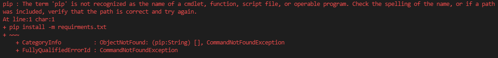

So now workflow I assume is that an admin have python and everything 
installed, and runs script on a folder, script recognizes all images 
and creates excel file with results. 
The excel file contains both images and recognized names/damages

Readiness: 

- [x] initial image recognition
- [x] working with multiple resolutions
- [x] auto mark duplicated records
- [x] parse multiple raid pictures
- [x] create output excell file
- [ ] calculate hit time, corresponding to screenshot time

## Installation

1. Install tesseract

    https://github.com/UB-Mannheim/tesseract/wiki

2. Install python 
    
    https://anaconda.org/

3. Download this repo  
   (if you don't know how to use GitHub, you can download zipped file
   `Code -> Download zip`)
 
4. Open python console in a folder with cloned/unzipped code and do:

    ```
   pip install -m requirments.txt
    ```
5. Run test, to check you nailed and it working

   ```bash
    python test.py
   ```
   You should see in a details how a test image is processed (just press space)    

## Run

In the directory with gt.py run 

```bash
python gt.py <path to files>
python gt.py screenshot1.jpg screenshot2.jpg
python gt.py screenshot_folder/* 
```

Flags:

- ```-d```, ```--debug``` - Enable debugging output. 0-none, 1-prings, 2-show images
- ```-r```, ```--report``` - Report folder (set blank for no report)
- ```-o```, ```--output``` - File name of resulting xlsx
- ```-t```, ```--tesseract``` - Full path to tesseract.exe

## Results

You have a resulting file called by default ```result.xlsx``` 


(!) Pink cells - means same damage with the same name happened before, probably duplicate reord

## Problems

**1 pip is not found:** 



You have installed python without pip (python package manager). 
Either install anaconda (overkill, but reliable) or google how to install pip

**2 Resolution is not found**

This software needs coordinates how to crop images for each resolution. 
And there are myriads resolutions out here now. So probably this resolution
is not yet supported. One needs to add cropping coordinates to dimensions.yaml file
And if you successfully do this, don't forget to submit this changes to this repo.

**3 Tesseract is not found**

You need tesseract package installed to run. By default it is:

```
C:\Program Files\Tesseract-OCR\tesseract.exe
```

If it is installed in another path use ```-t``` flag. And don't forget about double
`\\` on windows when you do. Btw, use better `/` it also works and don't blow your mind


## Add your resolution

If the beast is not working because your resolution is unknown, you have to edit
dimensions.yaml

all crop rectangles are given like: 

```yaml
hits_window:
   x_start: 431
   y_start: 148
   x_end: 1770
   y_end: 1003
```
Those are absolute coordinates of rectangles from left top corner of a picture. 
Just use one of the graphics editor which shows pixel coordinates under mouse (even 
paint should do it... I think)

**hits_window**
Coordinates from your original screenshot. Should be this rectangle:
(!) black outer borders are important to recognize hits boxes 


**hit_image**
After each hit is cropped, the software dissects hit image like this: 


- name_rect - blue
- party_rect - green
- damage_rect - yellow
- boss_rect - red

## Debugging

When you run gt.py it creates "report" folder with all sub images it creates, 
you should see how it processes images and what it sees. 

Or use ```--debug=2``` flag. It will show you all interactively

```
python gt.py --debug=2 your_file.jpg
```

And report bugs and everything here!